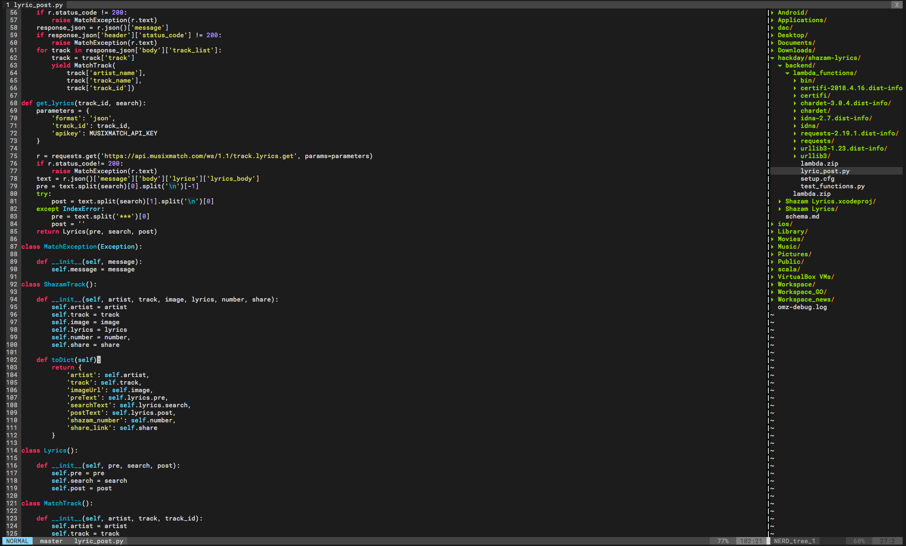
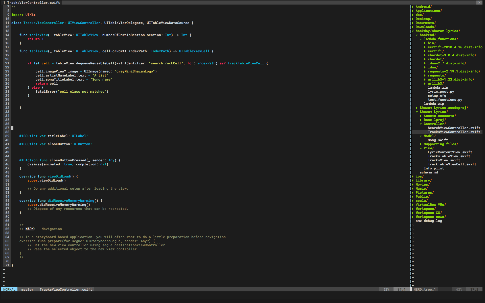

# Moonokai

Moonokai is a vim colorscheme loosely based on Sublime's monokai colour scheme (but with more blue!)

## Example Images:

> Python

>Swift

## Install Instructions:

*With Pathogen*: `git clone` this repository to your regular plugins directory.
